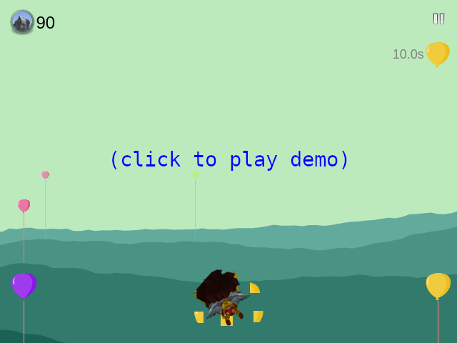

# game-balloon-mountains
Simple web game where you fly over misty mountains and pop balloons. 15 different levels. Complete achievements to unlock new levels.

The game works in Chrome and Firefox and on mobile (Android). It is written in vanilla javascript (~3100 LOC, 95kB) and uses HTML Canvas for rendering.

How to play: In the beginning of each level a objective is displayed. Swipe left and right to control flying or use left/right arrows or A/D keys or mouse left button to control flying.

### My other games

- [Alien invasion](https://github.com/dvhx/game-alien-invasion) - 2D bullet hell alien shooter, collect credits and upgrade your ship
- [Beach volleyball](https://github.com/dvhx/game-beach-volleyball) - play beach volleyball against opponent using swipe up gesture (or mouse)
- [Callisto space simulator](https://github.com/dvhx/game-callisto-space-simulator) - Newtonian non-relativistic current technology real-time space simulator with visual and instrumental flight
- [Ghost car challenge](https://github.com/dvhx/game-ghost-car-challenge) - WebGL 3D game where you compete against "ghost drivers", uses tilt sensor on mobile phones (Android)
- [Ghost chat bot](https://github.com/dvhx/game-ghost-chatbot) - chat with very simple chatbot, no LLM!
- [Ghost town](https://github.com/dvhx/game-ghost-town) - 2D top-view pixel art web game where you walk and talk with various NPCs and solve quests
- [Ghost town 2](https://github.com/dvhx/game-ghost-town-2) - fight monsters and solve quests, non-talking sequel to ghost town game
- [Hide and seek](https://github.com/dvhx/game-hide-and-seek) - 2D top-view pixel art hide and seek game with a flashlight effect
- [Robot puzzle](https://github.com/dvhx/game-robot-puzzle) - control robot using simple instructionsto solve logical puzzles
- [Trash everything](https://github.com/dvhx/game-trash-everything) - destroy furniture in 2D pixel art levels
- [Virtual boyfriend](https://github.com/dvhx/game-virtual-boyfriend) - talk with cute virtual boyfriend, buy clothes, visit locations, play mini games
- [Word puzzle](https://github.com/dvhx/game-word-puzzle) - crossword-like puzzle

### Support

You can support development on [Patreon](https://www.patreon.com/DusanHalicky) or you can hire me via [Upwork](https://www.upwork.com/freelancers/~013b4c3d6e772fdb01)

